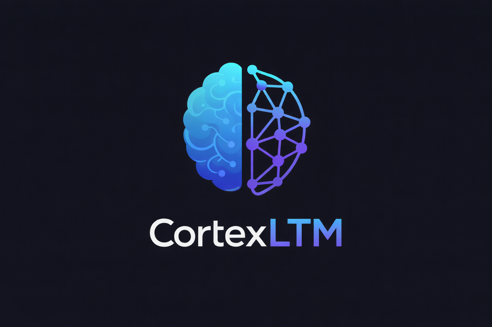

# CortexLTM — Current Project Status (Feb 2026)

CortexLTM is a **schema-driven long-term memory layer** for LLM apps/agents.

## Release Notes (Feb 2026)

- Added API auth mode support:
  - `AUTH_MODE=dev` for local/open-source contributor workflows.
  - `AUTH_MODE=supabase` for bearer-token-protected API usage.
- Added Supabase token validation on `/v1/*` API routes.
- Added thread ownership enforcement for authenticated users.
- Updated env/docs to include `SUPABASE_URL` and `SUPABASE_ANON_KEY` for auth mode.

## Video walkthrough

[](https://youtu.be/Efa-n6bWVzE?si=81STTdWayP0wizk1)

**Goal:** give any chat app a clean, swappable “memory backend” that supports:
- **Threaded conversations**
- **Event logging**
- **Rolling summaries / episodic memory**
- **Semantic retrieval (pgvector)**
- A simple API surface you can plug into *your* agent/chat stack

This repo currently includes a working v1 of that pipeline using:
- **Postgres / Supabase** for storage
- **pgvector** for embeddings + distance search
- **OpenAI embeddings** (`text-embedding-3-small`, 1536 dims) for vectorization
- **Groq** (Llama 3.1) for summary generation + optional chat reply (dev harness)

---

## What works right now (v1)

### Database schema (SQL migrations)
The schema is implemented as ordered SQL scripts:

- `sql/00_extensions.sql`
  - Enables `pgcrypto` (UUIDs) and `vector` (pgvector)

- `sql/01_threads.sql`
  - `ltm_threads`: conversation container
  - Includes `user_id uuid not null` for cross-chat identity

- `sql/02_events.sql`
  - `ltm_events`: append-only message log per thread
  - Optional **event-level embeddings**
  - Indexes optimized for “last N messages” and filtering

- `sql/03_summaries.sql`
  - `ltm_thread_summaries`: rolling summary + episodic memory model
  - Enforces **exactly one active** summary per thread via partial unique index
  - Optional summary embeddings for semantic retrieval

- `sql/04_master_memory.sql`
  - `ltm_master_items`: user-level memory store (cross-chat)
  - `ltm_master_evidence`: audit trail linking items to threads/events/summaries
  - `set_updated_at()` trigger helper for `updated_at`

---

## Thread creation + event logging (Python)
Core functions:
- `create_thread(user_id, title=None)` inserts into `ltm_threads`
  - `user_id` is required because `ltm_threads.user_id` is `NOT NULL`
- `add_event(thread_id, actor, content, meta, importance_score=0, embed=False)`
  - Writes into `ltm_events`
  - Auto-scores **user** messages if caller leaves `importance_score=0`
  - Auto-embeds events when importance is high (>=5)
  - After an **assistant** event is written, it triggers `maybe_update_summary()`

### Importance scoring (v1 heuristic)
A lightweight scoring function `_score_importance()` categorizes user messages:
- `5` = identity/profile facts OR explicit “remember this”
- `3` = plans/commitments/constraints (“I need to…”, “we should…”, “must…”, etc.)
- `1` = preferences / durable details
- `0` = trivial chatter

If score >= 5, the event is force-embedded as an “early memory buffer”.

### Master-memory capture heuristics
The auto master-memory hook now listens for general cues about ongoing work so we do not have to wait for a full rolling summary. Phrases like “project”, “learning”, “lesson”, “plan”, “vacation”, “working on”, “projects”, “memory layer”, or “memory specific” are mapped into `PROJECTS` or `LONG_RUNNING_CONTEXT` buckets and upserted immediately with metadata. That keeps facts available for cross-thread semantic searches before 12 meaningful turns finish.

### LLM-based extractor (v1)
`master_memory_extractor.py` is a Groq-powered extractor that reads the most recent events for a thread, sends them to the LLM, and parses the JSON array it returns. Each claim is bucketed (projects, long-running context, profile, goals, etc.), written to `ltm_master_items`, and annotated with evidence (thread/event IDs). The extractor fires whenever a user event looks highly important (importance >=5), so durable facts appear in master memory even before the rolling summary threshold is reached.

### Embeddings provider (OpenAI, swappable later)
`cortexltm/embeddings.py` provides one function:
- `embed_text(text) -> list[float]`

Behavior:
- Uses official OpenAI SDK
- Defaults to `text-embedding-3-small`
- Hard asserts **1536** dimensions to match DB `vector(1536)`
- Basic safety clamp by **characters** (no token dependency)

### Semantic search over events (pgvector)
`search_events_semantic(query, k=5, thread_id=None)`:
- embeds the query
- runs pgvector distance search:
  - `ORDER BY embedding <-> query_embedding`
- returns a list of hits with `distance`

Notes:
- Only searches events where `embedding IS NOT NULL`
- Optional `thread_id` filter

### Rolling summaries + episodic memory (meaningful-turn based)
`cortexltm/summaries.py` implements automatic summary updates:

- **Definitions**
- - A **TURN** = user event + the next assistant event (if present)
- - A turn is “meaningful” via `is_meaningful_turn(user_text, assistant_text)`
- - When enough meaningful turns accumulate (currently **12**), we update/insert a summary row.

- **Current knobs (v1)**
- - `MEANINGFUL_TARGET = 12` meaningful turns required to summarize
- `FETCH_LOOKBACK = 120` max events pulled since last summary end
- `TOPIC_SHIFT_COSINE_MIN = 0.75` threshold to split into a new episode

**How it updates**
1. Fetch events since the active summary’s `range_end_event_id` (by created_at).
2. Build meaningful turns (user + next assistant).
3. If meaningful turns < target → do nothing.
4. Build compact turn lines: `USER: ... | ASSISTANT: ...`
5. Produce a candidate summary:
   - Preferred: Groq LLM via `summarize_update()`
   - Fallback: heuristic concatenation if LLM fails
6. Topic shift check:
   - Embed `prior_summary` and `candidate`
   - Compute cosine similarity in pure Python (no numpy)
   - If similarity < threshold → archive active summary & insert a new episode
   - Else → update the existing active summary

Each summary row stores:
- `summary` text
- `range_start_event_id`, `range_end_event_id`
- `meta` (why/when it updated)
- optional `embedding`

### LLM harness (Groq) for summaries + dev chat
`cortexltm/llm.py` is currently used for:
- `summarize_update(prior_summary, turn_lines)` — generates concise bullet summary
- `chat_reply(user_text, context_messages)` — dev-friendly chat response

This is a **harness** for development. Production apps will typically:
- Use their own LLM runtime
- Call CortexLTM for memory writes + retrieval + summarization policies

### CLI dev harness
A simple CLI loop exists to test end-to-end behavior:
- Creates a thread (requires a user id)
- Logs user events
- Generates assistant replies (Groq)
- Logs assistant events
- Automatically triggers summary updates when assistant messages are written

The CLI now only prepends semantic retrieval hits when `_needs_semantic_memory()` sees cues such as “recap,” “what was the plan,” or “remember,” and each retrieved block is formatted via `_format_retrieved_block()` so the LLM sees concise evidence instead of a noisy dump.

This is intentionally a test harness — the “real product” is the memory layer.

---

## Repo layout (current)
- `cortexltm/`
  - `db.py` — Postgres connection via `SUPABASE_DB_URL`
  - `embeddings.py` — OpenAI embedding wrapper
  - `llm.py` — Groq wrapper for chat + summarization
  - `summaries.py` — rolling summary + topic shift logic
  - `messages.py` — thread/event helpers + semantic search
  - `cli_chat.py` — CLI harness
  - `__init__.py` — version metadata
- `sql/`
  - `00_extensions.sql`
  - `01_threads.sql`
  - `02_events.sql`
  - `03_summaries.sql`
  - `04_master_memory.sql`
- `.env.example` — env template
- `README.md` — setup instructions (actively evolving)

---

## Environment variables (current)
Required:
- `SUPABASE_DB_URL` — Postgres connection string
- `OPENAI_API_KEY` — embeddings
- `GROQ_API_KEY` — summary LLM (and optional chat harness)
- `CORTEXLTM_USER_ID` — uuid used by the CLI harness (dev identity)

Optional:
- `OPENAI_EMBED_MODEL` (default `text-embedding-3-small`)
- `GROQ_CHAT_MODEL` (default `llama-3.1-8b-instant`)
- `GROQ_SUMMARY_MODEL` (default `llama-3.1-8b-instant`)

---

## What’s intentionally “v1 simple” (known limitations)
These are deliberate tradeoffs to keep CortexLTM small and shippable early:

- **No token counting**: character clamps are used instead of tokenizer deps.
- **Meaningfulness scoring is heuristic**: it’s good enough to start, not final.
- **Topic shift detection** uses embedding similarity of summaries:
  - works well as a first pass
  - may need tuning per domain
- **Synchronous embedding calls** inside writes:
  - simple, but can increase latency/cost
  - future: async/queue/batch
- **No formal retrieval composer yet**:
  - event semantic search exists
  - summary search can be added next (same pattern)
  - master memory write policy is next
- **No tests yet**:
  - next step is a minimal test suite for DB + summarization boundaries
- **No packaging polish yet**:
  - early structure is compatible with turning into a pip package / SDK

---

## Next steps (high-impact roadmap)

1) **Add summary semantic search**
   - `search_summaries_semantic(query, k=5, thread_id=None)`
   - same pgvector pattern as events

2) **Unified retrieval function**
   - a simple `retrieve_memory(user_id, thread_id, query)` returning:
     - active summary
     - top-K similar summaries (optional)
     - top-K similar events (optional)
     - top-K relevant master memory items (cross-chat)
     - most recent N raw events (context)

3) **Master memory writer policy**
   - controlled v1 extractor that proposes:
     - new master items
     - reinforcement of existing items
     - conflict/deprecate actions
   - writes evidence links into `ltm_master_evidence`

4) **Provider abstraction**
   - Embeddings: OpenAI now, but support local later (e.g., sentence-transformers)
   - Summaries: Groq now, but support OpenAI / local later

5) **Batch + retry strategy**
   - better handling for rate limits / transient failures
   - optional queue-based embedding

6) **Packaging + docs**
   - clean public API surface:
     - `create_thread(user_id)`
     - `add_event()`
     - `retrieve_memory()`
     - `search_events_semantic()`
   - minimal examples for:
     - “drop-in memory for an agent”
     - “memory for a web app”
     - “memory for a robot / device assistant”

---

## CortexLTM
Schema-driven long-term memory layer for LLMs and agents.

Make sure you have/are on:  
`winget install -e --id Python.Python.3.12`  
64 bit not 32 bit

## Basic Project Setup

1) In your repo, create a Python venv by running -

```powershell
py -m venv .venv
.\.venv\Scripts\Activate.ps1
```

2) Install the Groq SDK or similar -

```powershell
pip install groq
```

3) If using .env install -

```powershell
pip install python-dotenv
```

4) Refer to `.env.example`

5) Create `groq_test.py` (or similar) to load .env and test you get a response. Run with -

```powershell
python groq_test.py
```

6) if you have issues with unresolved imports do this -

Press Ctrl + Shift + P  
Type: Python: Select Interpreter  
Pick: `C:\myproject\.venv\Scripts\python.exe` (or whatever your project path is).

7) Install the DB driver in the same activated venv terminal -

```powershell
pip install psycopg2-binary ----- version 2.9.11
```

8) Install openai SDK for embedding model -

```powershell
pip install openai
```

9) Install API server dependencies (for UI integration) -

```powershell
pip install fastapi uvicorn
```

---

## Run Scripts in sql folder

Scripts are numbered in the order they were ran. It is highly recommended to run them in the exact order as they are listed.

---

## Run CortexLTM API (for CortexUI)

Start the HTTP API layer so UI clients can call CortexLTM instead of writing SQL directly:

```powershell
uvicorn cortexltm.api:app --host 0.0.0.0 --port 8000
```

Optional env vars:
- `CORTEXLTM_API_KEY` (if set, clients must send this value as `x-api-key`)
- `AUTH_MODE` (`dev` or `supabase`, default `dev`)
- `SUPABASE_URL` (required in `AUTH_MODE=supabase`)
- `SUPABASE_ANON_KEY` (required in `AUTH_MODE=supabase`)

## API Auth Modes

- `AUTH_MODE=dev`
  - Existing behavior for open-source local development.
  - `/v1/*` routes do not require bearer tokens.
  - If `CORTEXLTM_API_KEY` is set, `x-api-key` is still enforced.

- `AUTH_MODE=supabase`
  - `/v1/*` routes require `Authorization: Bearer <supabase_access_token>`.
  - Token validity is checked against `SUPABASE_URL/auth/v1/user`.
  - Thread-scoped routes verify thread ownership against authenticated `user_id`.
  - `user_id` query/body values from clients are ignored in favor of auth identity.
